### Insert Into
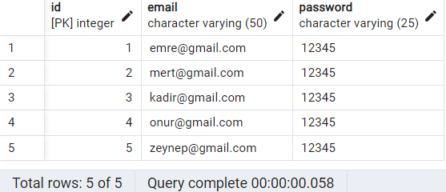
```sh
Insert Into users 
Values
(DEFAULT, 'xyzticaret@gmail.com', '54321')
```
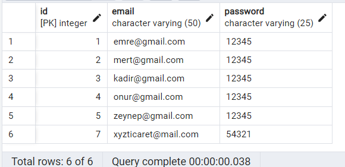
### Update
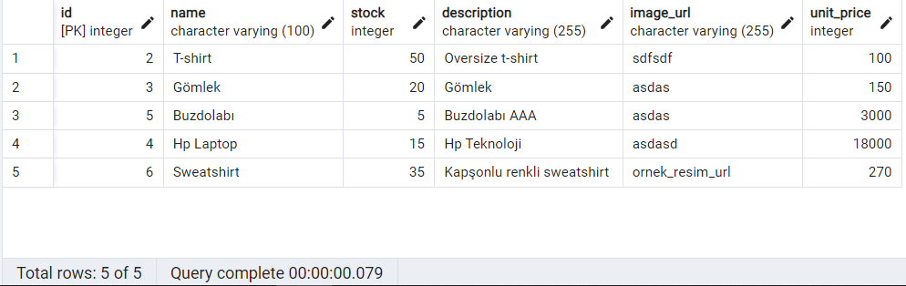
```sh
Update products 
Set unit_price=12000 
Where id=4
```
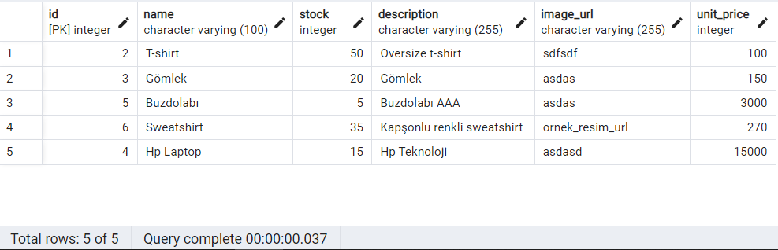
### Delete
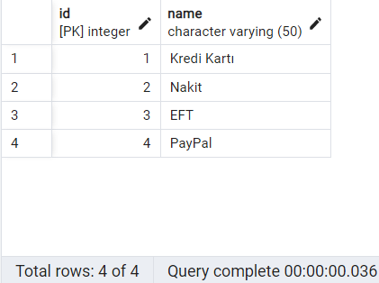
```sh
Delete from payment_types 
where id = 4
```
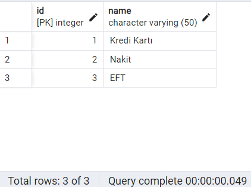
### Between
```sh
Select name, unit_price
From products
Where unit_price between 100 and 200
```
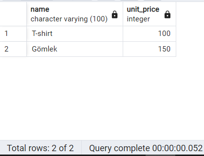
### In
```sh
select ci.name as "Şehir", ic.first_name, ic.last_name
From individual_customers ic
inner join customers c
on ic.id = c.id
inner join users us
on c.id = us.id
inner join addresses ad
on ad.user_id = us.id
inner join streets st
on ad.street_id = st.id
inner join districts di
on st.district_id = di.id
inner join towns t
on di.town_id = t.id
inner join cities ci
on t.city_id = ci.id
where ci.name in ('Ankara', 'İzmir')
```
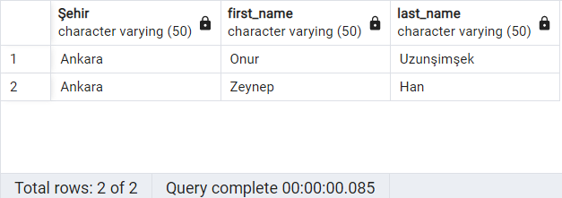
### Group By & Having
```sh
Select ci.name as "Şehir", count(*) "Müşteri Sayısı"
From cities ci
inner join towns tw
on ci.id = tw.city_id
inner join districts di
on tw.id = di.town_id
inner join streets st
on di.id st.district_id
inner join addresses ad
on st.id = ad.street_id
inner join users us
on us.id = ad.user_id
inner join customers cu
on us.id = cu.id
group by ci.name having count (*) > 2
```
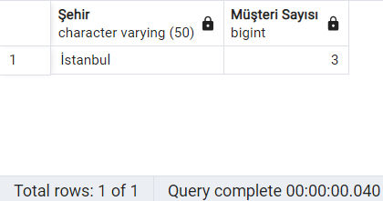
### Inner Join
```sh
Select ic.first_name, ic.last_name, us.email
From individual_customers ic
inner join users us
on ic.id = us.id
```
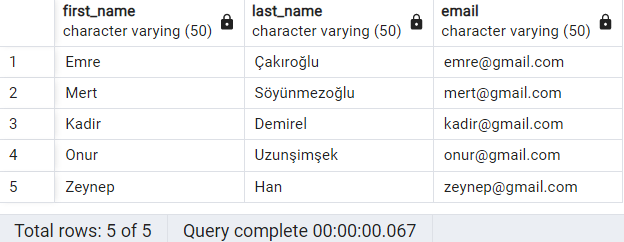
### Left Join 
```sh
Select ic.first_name as "Bireysel Müşteri Adı", ic.last_name as "Bireysel Müşteri Soyadı",
cc.name as "Kurumsal Müşteri Adı",
se.name as "Satıcı Adı"
From users us
left join individual_customers ic
on ic.id = us.id
left join corporate_customers cc
on cc.id = us.id
left join sellers se
on se.id = us.id
```
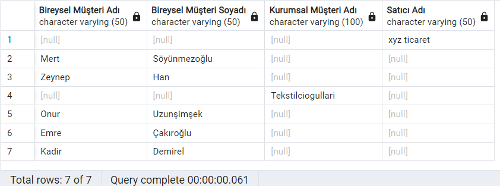
### Right Join
```sh
Select ci.name, tow.name, di.name, st.name, ad.address
From addresses ad
right join streets st
on ad.street_id = st.id
right join districts di
on st.district_id = di.id
right join towns tow
on di.town_id = tow.id
right join cities ci
on tow.city_id = ci.id
```
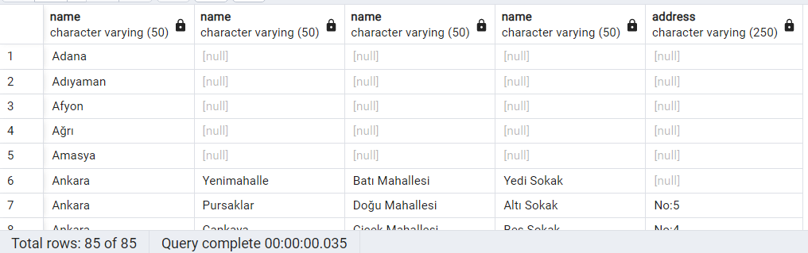
### Full Outer Join
```sh
Select pr.name, pr.unit_price, bi.quantity, ba.total_price 
From basket_items bi
full outer join baskets ba
on bi.basket_id = ba.id
full outer join products pr
on bi.product_id = pr.id
```
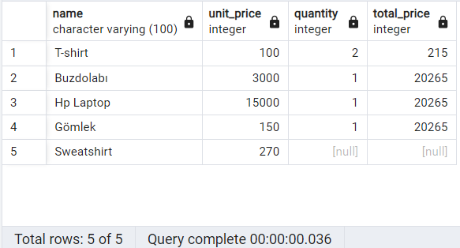